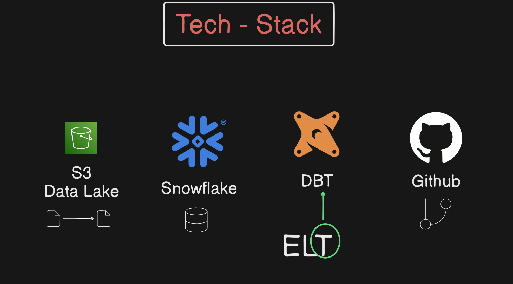

# Airbnb End-to-End Data Engineering Project

## Overview

This project implements a complete end-to-end data engineering pipeline for Airbnb data using modern cloud technologies. The solution demonstrates best practices in data warehousing, transformation, and analytics using **Snowflake**, **dbt (Data Build Tool)**, and **AWS**.

The pipeline processes Airbnb listings, bookings, and hosts data through a medallion architecture (Bronze → Silver → Gold), implementing incremental loading, slowly changing dimensions (SCD Type 2), and creating analytics-ready datasets.

## Architecture

### Data Flow
```
Source Data (CSV) → AWS S3 → Snowflake (Staging) → Bronze Layer → Silver Layer → Gold Layer
                                                           ↓              ↓           ↓
                                                      Raw Tables    Cleaned Data   Analytics
```

### Technology Stack



- **Cloud Data Warehouse**: Snowflake
- **Transformation Layer**: dbt (Data Build Tool)
- **Cloud Storage**: AWS S3 (implied)
- **Version Control**: Git
- **Python**: 3.12+
- **Key dbt Features**:
  - Incremental models
  - Snapshots (SCD Type 2)
  - Custom macros
  - Jinja templating
  - Testing and documentation

## Data Model

### Medallion Architecture

#### Bronze Layer (Raw Data)
Stores raw data as-is, Full historical retention:
- `bronze_bookings` - Raw booking transactions
- `bronze_hosts` - Raw host information
- `bronze_listings` - Raw property listings

#### Silver Layer (Cleaned Data)
Deduplicated, cleaned, standardized data, Structured for analytics:
- `silver_bookings` - Validated booking records
- `silver_hosts` - Enhanced host profiles with quality metrics
- `silver_listings` - Standardized listing information with price categorization

#### Gold Layer (Analytics-Ready)
Aggregated, enriched datasets, Ready for BI & reporting:
- `obt` (One Big Table) - Denormalized fact table joining bookings, listings, and hosts
- `fact` - Fact table for dimensional modeling
- Ephemeral models for intermediate transformations

#### Benefits
- Data integrity
- Scalability
- Better performance
- Role-based access control

### Snapshots (SCD Type 2)
Slowly Changing Dimensions to track historical changes:
- `dimension_bookings` - Historical booking changes
- `dimension_hosts` - Historical host profile changes
- `dimension_listings` - Historical listing changes

## Project Structure

```
AWS_DBT_Snowflake/
├── README.md                           # This file
├── pyproject.toml                      # Python dependencies
├── main.py                             # Main execution script
│
├── SourceData/                         # Raw CSV data files
│   ├── bookings.csv
│   ├── hosts.csv
│   └── listings.csv
│
├── DDL/                                # Database schema definitions
│   ├── ddl_query.sql                         # Table creation scripts
│   └── resources.sql
│
└── aws_dbt_snowflake_project/         # Main dbt project
    ├── dbt_project.yml                 # dbt project configuration
    ├── ExampleProfiles.yml             # Snowflake connection profile
    │
    ├── models/                         # dbt models
    │   ├── sources/
    │   │   └── sources.yml             # Source definitions
    │   ├── bronze/                     # Raw data layer
    │   │   ├── bronze_bookings.sql
    │   │   ├── bronze_hosts.sql
    │   │   └── bronze_listings.sql
    │   ├── silver/                     # Cleaned data layer
    │   │   ├── silver_bookings.sql
    │   │   ├── silver_hosts.sql
    │   │   └── silver_listings.sql
    │   └── gold/                       # Analytics layer
    │       ├── fact.sql
    │       ├── obt.sql
    │       └── ephemeral/              # Temporary models
    │           ├── bookings.sql
    │           ├── hosts.sql
    │           └── listings.sql
    │
    ├── macros/                         # Reusable SQL functions
    │   ├── generate_schema_name.sql    # Custom schema naming
    │   ├── multiply.sql                # Math operations
    │   ├── tag.sql                     # Categorization logic
    │   └── trimmer.sql                 # String utilities
    │
    ├── analyses/                       # Ad-hoc analysis queries
    │   ├── explore.sql
    │   ├── if_else.sql
    │   └── loop.sql
    │
    ├── snapshots/                      # SCD Type 2 configurations
    │   ├── dimension_bookings.yml
    │   ├── dimension_hosts.yml
    │   └── dimension_listings.yml
    │
    ├── tests/                          # Data quality tests
    │   └── source_tests.sql
    │
    └── seeds/                          # Static reference data
```

## Getting Started

### Prerequisites

1. **AWS S3 (Data Lake Setup)**
   - Go to AWS Console → S3
   - Create bucket:
      - snowflakebucket17-03-26
         - Inside bucket:
            - Create folder: source
            - Upload CSV files

2. **Snowflake Account (will create one if doesn't exist)**
   - Create Database & Schema
   - Database: AIRBNB
   - Schema: STAGING

3. **Python Environment**
   - Python 3.12 or higher
   - pip or uv package manager

4. **AWS Account (will create one if doesn't exist)** (for S3 storage)

### Installation

1. **Python Setup**
   ```bash
   Initially installed Python 3.12
   Encountered compatibility issues with dbt
   Switched to Python 3.11
   ```

2. **Create Virtual Environment**
   ```bash
   - python -m venv .venv
   - .venv\Scripts\Activate.ps1  # Windows PowerShell
   # or
   - pip install uv
   - go to python version: change to 3.12
   - uv sync
   - to activate venv: source .venv/bin/activate    # Linux/Mac
   ```

3. **Install Dependencies**
   ```bash
   pip install -r requirements.txt
   # or using pyproject.toml
   pip install -e .
   # or using uv
   uv add dbt-core
   ```

   **Core Dependencies:**
   - `dbt-core>=1.11.2`
   - `dbt-snowflake>=1.11.0`
   - `sqlfmt>=0.0.3`

4. **Configure Snowflake Connection**
   
   Create `~/.dbt/profiles.yml`:
   ```yaml
   aws_dbt_snowflake_project:
     outputs:
       dev:
         account: <your-account-identifier>
         database: AIRBNB
         password: <your-password>
         role: ACCOUNTADMIN
         schema: dbt_schema
         threads: 1
         type: snowflake
         user: <your-username>
         warehouse: COMPUTE_WH
     target: dev
   ```

5. **Set Up Snowflake Database**
   
   Run the DDL scripts to create tables:
   ```bash
   # Execute DDL/ddl.sql in Snowflake to create staging tables
   ```

6. **Load Source Data**
   
   Load CSV files from `SourceData/` to Snowflake staging schema:
   - `bookings.csv` → `AIRBNB.STAGING.BOOKINGS`
   - `hosts.csv` → `AIRBNB.STAGING.HOSTS`
   - `listings.csv` → `AIRBNB.STAGING.LISTINGS`

## Usage

### Running dbt Commands

1. **Test Connection**
   ```bash
   cd aws_dbt_snowflake_project
   dbt debug
   ```

2. **Install Dependencies**
   ```bash
   dbt deps
   ```

3. **Run All Models**
   ```bash
   dbt run
   ```

4. **Run Specific Layer**
   ```bash
   dbt run --select bronze.*      # Run bronze models only
   dbt run --select silver.*      # Run silver models only
   dbt run --select gold.*        # Run gold models only
   ```

5. **Run Tests**
   ```bash
   dbt test
   ```

6. **Run Snapshots**
   ```bash
   dbt snapshot
   ```

7. **Generate Documentation**
   ```bash
   dbt docs generate
   dbt docs serve
   ```

8. **Build Everything**
   ```bash
   dbt build  # Runs models, tests, and snapshots
   ```

## Key Features

### 1. Incremental Loading   
Bronze and silver models use incremental materialization to process only new/changed data:
```sql
{{ config(materialized='incremental') }}

    WHERE CREATED_AT > (SELECT COALESCE(MAX(CREATED_AT), '1900-01-01') FROM {{ this }})

```

### 2. Custom Macros
Reusable business logic:
- **`tag()` macro**: Categorizes prices into 'low', 'medium', 'high'
  ```sql
  {{ tag('CAST(PRICE_PER_NIGHT AS INT)') }} AS PRICE_PER_NIGHT_TAG
  ```

### 3. Dynamic SQL Generation
The OBT (One Big Table) model uses Jinja loops for maintainable joins:
```sql

SELECT ...
```

### 4. Slowly Changing Dimensions
Track historical changes with timestamp-based snapshots:
- Valid from/to dates automatically maintained
- Historical data preserved for point-in-time analysis

### 5. Schema Organization
Automatic schema separation by layer:
- Bronze models → `AIRBNB.BRONZE.*`
- Silver models → `AIRBNB.SILVER.*`
- Gold models → `AIRBNB.GOLD.*`

## Data Quality

### Testing Strategy
- Source data validation tests
- Unique key constraints
- Not null checks
- Referential integrity tests
- Custom business rule tests

### Data Lineage
dbt automatically tracks data lineage, showing:
- Upstream dependencies
- Downstream impacts
- Model relationships
- Source to consumption flow

## Security & Best Practices

1. **Credentials Management**
   - Never commit `profiles.yml` with credentials
   - Use environment variables for sensitive data
   - Implement role-based access control (RBAC) in Snowflake

2. **Code Quality**
   - SQL formatting with `sqlfmt`
   - Version control with Git
   - Code reviews for model changes

3. **Performance Optimization**
   - Incremental models for large datasets
   - Ephemeral models for intermediate transformations
   - Appropriate clustering keys in Snowflake

## Additional Resources

- **dbt Documentation**: https://docs.getdbt.com/
- **Snowflake Documentation**: https://docs.snowflake.com/
- **dbt Best Practices**: https://docs.getdbt.com/guides/best-practices

## Contributing

1. Fork the repository
2. Create a feature branch (`git checkout -b feature/AmazingFeature`)
3. Commit your changes (`git commit -m 'Add some AmazingFeature'`)
4. Push to the branch (`git push origin feature/AmazingFeature`)
5. Open a Pull Request

## Troubleshooting

### Common Issues

1. **Connection Error**
   - Verify Snowflake credentials in `profiles.yml`
   - Check network connectivity
   - Ensure warehouse is running

2. **Compilation Error**
   - Run `dbt debug` to check configuration
   - Verify model dependencies
   - Check Jinja syntax

3. **Incremental Load Issues**
   - Run `dbt run --full-refresh` to rebuild from scratch
   - Verify source data timestamps

## Future Enhancements

- [ ] Add data quality dashboards
- [ ] Implement CI/CD pipeline
- [ ] Add more complex business metrics
- [ ] Integrate with BI tools (Tableau/Power BI)
- [ ] Add alerting and monitoring
- [ ] Implement data masking for PII
- [ ] Add more comprehensive testing suite
